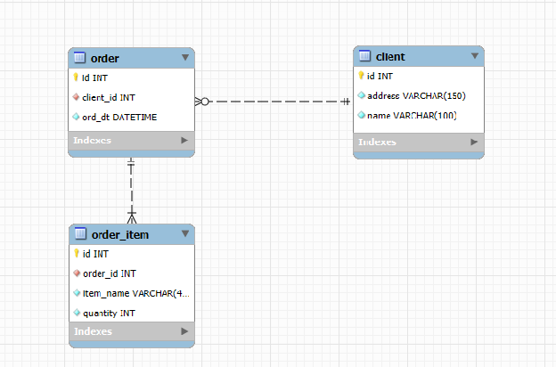
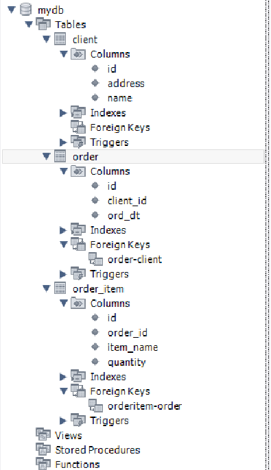

**Початкова таблиця**

| Номер\_замовлення | Назва\_товару і кількість | Адреса\_клієнта | Дата\_замовлення | Клієнт |
| :---- | :---- | :---- | :---- | :---- |
| 101 | Лептоп: 3, Мишка: 2 | Хрещатик 1 | 2023-03-15 | Мельник |
| 102 | Принтер: 1 | Басейна 2 | 2023-03-16 | Шевченко |
| 103 | Мишка: 4 | Комп’ютерна 3 | 2023-03-17 | Коваленко |

**Опис домашнього завдання**

## 1\. Переведіть початкову таблицю в першу нормальну форму.

| Номер\_замовлення | Назва\_товару | Кількість | Адреса\_клієнта | Дата\_замовлення | Клієнт |
| :---- | :---- | :---- | :---- | :---- | :---- |
| 101 | Лептоп | 3 | Хрещатик 1 | 2023-03-15 | Мельник |
| 101 | Мишка | 2 | Хрещатик 1 | 2023-03-15 | Мельник |
| 102 | Принтер | 1 | Басейна 2 | 2023-03-16 | Шевченко |
| 103 | Мишка | 4 | Комп’ютерна 3 | 2023-03-17 | Коваленко |

## 2\. Переведіть нові таблиці в другу нормальну форму.

order

| Номер\_замовлення | Адреса\_клієнта | Дата\_замовлення | Клієнт |
| :---- | :---- | :---- | :---- |
| 101 | Хрещатик 1 | 2023-03-15 | Мельник |
| 102 | Басейна 2 | 2023-03-16 | Шевченко |
| 103 | Комп’ютерна 3 | 2023-03-17 | Коваленко |

order\_items

| Номер\_замовлення | Назва\_товару | Кількість |
| :---- | :---- | :---- |
| 101 | Лептоп | 3 |
| 101 | Мишка | 2 |
| 102 | Принтер | 1 |
| 103 | Мишка | 4 |

## 3\. Переведіть нові таблиці в третю нормальну форму.

order

| Номер\_замовлення | Клієнт | Дата\_замовлення |
| :---- | :---- | :---- |
| 101 | 1 | 2023-03-15 |
| 102 | 2 | 2023-03-16 |
| 103 | 3 | 2023-03-17 |

order\_items

| Номер\_замовлення | Назва\_товару | Кількість |
| :---- | :---- | :---- |
| 101 | Лептоп | 3 |
| 101 | Мишка | 2 |
| 102 | Принтер | 1 |
| 103 | Мишка | 4 |

clients

| Id клієнта | Адреса | Ім’я |
| :---- | :---- | :---- |
| 1 | Хрещатик 1 | Мельник |
| 2 | Басейна 2 | Шевченко |
| 3 | Комп’ютерна 3 | Коваленко |

## 4\. Розробіть ER-діаграму отриманих таблиць.

## 

## 5\. Використовуючи ER-діаграму, створіть таблиці в базі даних. Оформіть ці таблиці без конкретних значень, тільки з урахуванням колонок та їхніх зв'язків, вручну або автоматично.

